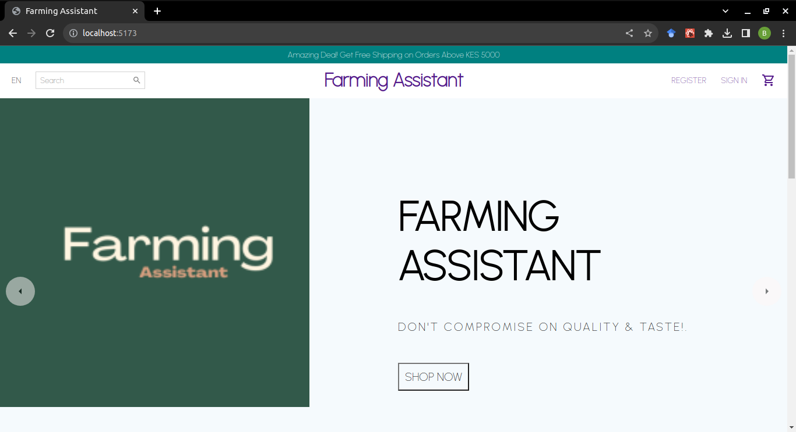
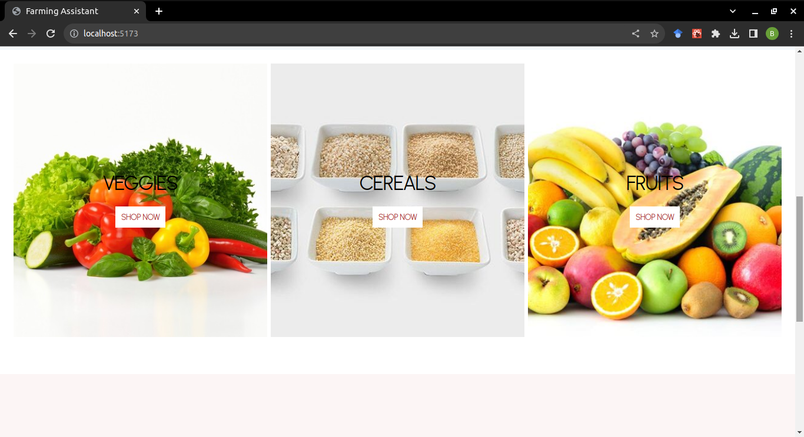

<h1 align="center">Farming Assistant</h1>

An eCommerce site for both farmers and consumers.

 

This repository contains a frontend eCommerce platform using React.js and an API interface using Node.js and MongoDB to store data.

### Installation

First, Clone the project from
`git clone https://github.com/brysonwaisi/farming-assistant.git`

The requirements for running this project are `React` , `node`, `mongoDB` and `express`.

### Firing up the application

To fire up the application once all the project dependencies have been successfully installed you can build and consume the project simply by:

- Running `yarn` in both folders to install all the required dependencies
- Starting the client development server by running `yarn run dev`
- Starting the server by running `yarn start`

#### Functionalities

- Display a slider to the site
  
- Choose a product based on the category
  
- Footer
  

### Environment

This project is interpreted/tested on Ubuntu 22.04 LTS using Node

 

## Authors

- **Bryson Nyamwange** <[brysonwaisi](https://github.com/brysonwaisi)>
